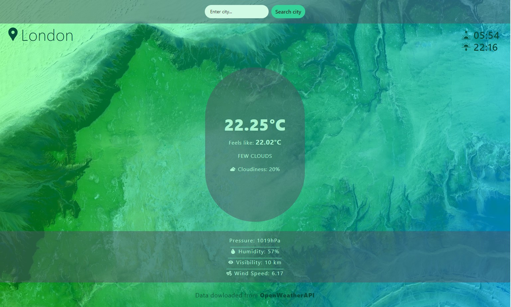
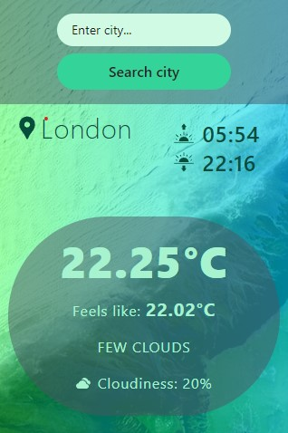

# Weather - App 🌤️

Weather App is a **responsive** and **user-friendly** application that allows you to check the weather conditions in various locations. It utilizes the weather data from an external API called [weatherAPI](https://openweathermap.org/).

This application has been developed using **Vite**, a modern build tool.

## 👁‍🗨Demo:

[See what the weather in your city is like!](https://maxnatalia.github.io/weather-app/)

Desktop devices:

Mobile devices:

## 📌Features:

- Get real-time weather updates for different places.
- View detailed weather information including temperature, humidity, wind speed, and more.
- Search for weather forecasts in any desired location.
- Enjoy a responsive design that adapts to different screen sizes.

## 🛠️Technologies:

- [x] HTML
- [x] CSS
- [x] JavaScript
- [x] ES6+features
- [x] Markdown
- [x] Tailwind CSS
- [x] Vite
- [x] React Hooks
- [x] React Query
